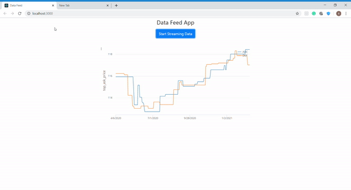

#Data Feed Streaming Analytics application

Real time data feed application using JP Morgan Chase Perspective framework 

Typically, traders monitor stock prices and trading strategies by having data displayed visually on their screens in chart form. Often these charts will be accompanied by alerts that notify users when certain events occur or when preset price thresholds are hit.

